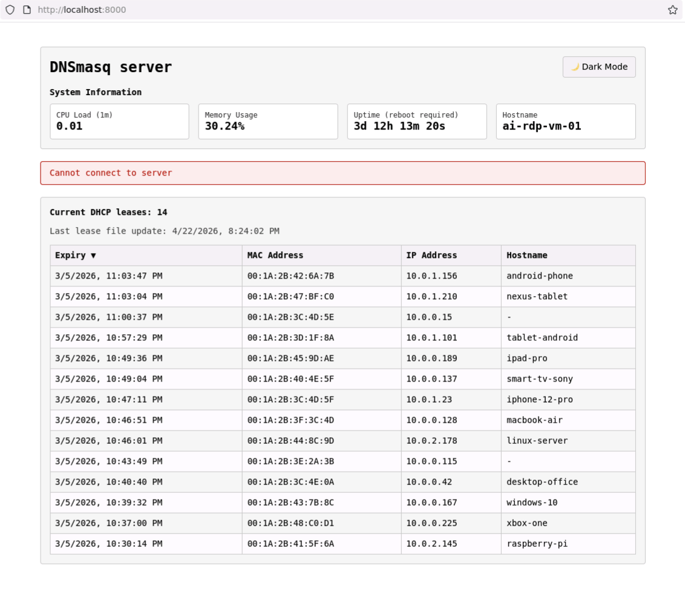

# DNSmasq Lease Viewer

This is a lightweight web app that displays DHCP lease information from a dnsmasq server's lease file, along with basic system information (system load, memory usage, uptime, hostname). This is currently used to display DHCP leases handed out from a Raspberry Pi 3 running `dnsmasq` in a homelab.


## Features

- Parses the dnsmasq lease file and displays leases in a table, reverse sorted by lease expiry time, which usually results in the most recent lease being on top
- Fields displayed: Lease expiry time, MAC address, IP address, hostname as seen by `dnsmasq`. The DHCP client ID field is returned by the server but ignored by the frontend for now (I am not using it; my `dnsmasq` is running with `dhcp-ignore-clid`)
- Auto-refreshes every 5 seconds
- Shows some system info: CPU load, memory usage, uptime, hostname
- Displays "(reboot required)" next to the Uptime label when `/var/run/reboot-required` exists on the host
- Times and dates are displayed using the browser's time zone conventions if correctly configured in the browser and/or the client OS
- Connection status banner (Hidden unless needed)
  - Alerts if the backend is offline
  - Alerts if the lease file cannot be read (permission denied/wrong path/corrupt file)
- Three display themes (light, dark, retro terminal)
- Click any MAC address, IP address, or hostname cell to copy its value to clipboard
- Minimal dependencies — uses only Python stdlib
- Network access control — restricts access to specific IP ranges
- Deployment toolkit included (more info below)

This is what it looks like, also showing the disconnected alert.




In the `/script` directory, there is a Python script that can be run on a dnsmasq server to display the current lease info in a similar way. This is completely separate from the web app.


## How & Why

This was an experiment in building a small app for my homelab using OpenCode and various mostly local LLMs. The basic features were converted to Python by Qwen3.6 (cloud, via OpenCode) from an earlier Node.js prototype built using glm-4.7, if I remember correctly. A few architectural changes and performance fixes were made after manual review and testing but all updates to code and container-related files (possibly with a few single-line exceptions) were done by LLMs. The same applies to this README, except for this text.

LLMs used: Mostly the Qwen family, 3.5/3.6 35B-A3B and Gemma-4 26B-A4B. Additional reviews were also provided occasionally by glm-4.7-flash and gpt-oss-20b. Claude Code also got to take a look at the final app.

The experiment was successful, I think. I pretty much got what I wanted and I learned a lot in the process. I ended up spending much more time than I initially expected on such a relatively simple project, but it's been fun, and at this point it has been optimized considerably and looks much better. Spending more time was entirely my choice; even the first prototype worked pretty well and had the necessary features.

An additional note about the choice of server language — the rewrite from Node.js was prompted by the realization that the app ended up with close to 70 dependencies installed and I wanted to keep the app as simple and easy to maintain as possible.


## Requirements

Python 3, versions 3.12, 3.13 and 3.14 are known to work. The code was created and tested on Linux — Debian 13 (x86_64) and Ubuntu 24.04 (aarch64).

The server uses about 10-20 MB memory and does not process anything unless a client is actively requesting data via the web page. This does not produce any noticeable load.

Any modern browser with Javascript enabled should work fine on the client side.

## Running

### Standalone

```bash
python src/server.py
```

Open http://localhost:8000

### Docker

Docker Compose V2.20+ required (for `pull_policy`).

```bash
docker compose up --build -d
```

Or build and run manually:

```bash
docker build -t dnsmasq-viewer .
docker run -d -p 8000:8000 \
  -e REBOOT_REQUIRED=/mnt/run/reboot-required \
  -v /var/lib/misc/dnsmasq.leases:/var/lib/misc/dnsmasq.leases:ro \
  -v /var/run:/mnt/run:ro \
  dnsmasq-viewer
```

> **Note:** The host's `/var/run` is a special directory (often a symlink to `/run`). Mounting it directly on top of the container's `/var/run` may not work as expected. The example and the compose file therefore mount it to `/mnt/run` instead, and set `REBOOT_REQUIRED=/mnt/run/reboot-required`.

### systemd

Copy the required files to their expected locations and enable the service:

```bash
sudo mkdir -p /opt/dnsmasq-viewer
sudo cp -r src/ public/ /opt/dnsmasq-viewer/
sudo cp dnsmasq-viewer.service /etc/systemd/system/
sudo systemctl daemon-reload
sudo systemctl enable --now dnsmasq-viewer.service
```

The service runs with systemd's `DynamicUser` (random unprivileged user, no home directory) and a hardened sandbox (`ProtectSystem=strict`, `NoNewPrivileges=yes`, etc.). Adjust `WorkingDirectory` and `ExecStart` in the unit file if you install the app somewhere other than `/opt/dnsmasq-viewer`.

## API

| Endpoint | Description |
|----------|-------------|
| `GET /` | Serves the web UI |
| `GET /leases` | Returns lease data as JSON |
| `GET /system-info` | Returns system metrics as JSON |
| `GET /status` | Returns `{"running": true}` in JSON format |

## Configuration

When using Docker Compose, you can also use a `.env` file in the project root to manage these variables. Copy `.env.example` and adjust as needed:

```bash
cp .env.example .env
```

| Environment variable | Description | Default |
|---------------------|-------------|---------|
| `HOST` | HTTP listen address. Set to `::` to enable IPv6 (dual-stack on Linux) | `0.0.0.0` |
| `PORT` | HTTP listen port | `8000` |
| `LEASEFILE` | Path to the dnsmasq lease file | `/var/lib/misc/dnsmasq.leases` |
| `HOSTNAME` | Override the system hostname | |
| `REBOOT_REQUIRED` | Path to the reboot-required marker file. Set to empty string to disable the check. | `/var/run/reboot-required` |
| `ALLOWED_NETWORKS` | Comma-separated list of allowed IPv4/IPv6 networks in CIDR notation. Connections from other IPs are rejected with `403 Forbidden`. | `192.168.0.0/16,127.0.0.1` |
| `DEBUG` | Enable detailed HTTP request logging to console | Not set (logging disabled) |

Example:

```bash
# Enable debug logging to see HTTP request details
DEBUG=1 python src/server.py

# Or in Docker
docker run -d -e DEBUG=1 -p 8000:8000 \
  -e REBOOT_REQUIRED=/mnt/run/reboot-required \
  -v /var/lib/misc/dnsmasq.leases:/var/lib/misc/dnsmasq.leases:ro \
  -v /var/run:/mnt/run:ro \
  dnsmasq-viewer
```

## IPv6

The server defaults to listening for IPv4 connections only. To enable dual-stack (both IPv4 and IPv6), set `HOST` to `::`. The `ALLOWED_NETWORKS` setting then also needs to be adjusted so that IPv6 connections are not rejected — for example by adding `fd00::/8` for private IPv6 networks.

Podman with modern `netavark`/`pasta` networking typically provides IPv6 connectivity automatically. Docker may require extra configuration — enabling IPv6 in the daemon configuration (`/etc/docker/daemon.json`) and potentially an explicit IPv6 port mapping in the compose file. Consult the Docker documentation for details.


## Known issues / Good-to-know

- DHCP client IDs not displayed since I am not using them in my setup.
- Network access control is enabled by default — only IPs in `192.168.0.0/16` or `127.0.0.1` can view data. Set `ALLOWED_NETWORKS` to customize, e.g. `10.0.0.0/8,172.16.0.0/12`.  Use `0.0.0.0/0,::/0` to allow all connections (both IPv4 and IPv6). Note that this only refuses to deliver data to unauthorized IPs — the server still accepts the TCP connection and responds with `403 Forbidden`. It is not a replacement for a proper firewall or network-level access control.
- The `reboot-required` file check is specific to Debian/Ubuntu-based Linux distributions with the `unattended-upgrades` package installed.
- There is no strict input validation on the lease file structure.
- By default, HTTP request logging is disabled to keep the console clean. Set the `DEBUG` environment variable to enable detailed request logging. When enabled, you may see garbled "Bad request" messages from clients that retry with HTTPS on the HTTP port — this is harmless and can be safely ignored.
